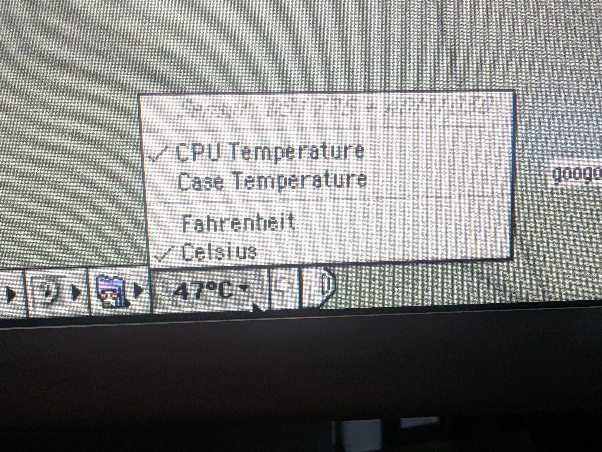

# Mac OS 9 — G4 CPU & Case Temperature (Control Strip module)

A **Control Strip module that shows live CPU (and, where available, case) temperature on Power
Mac G3/G4 machines under Mac OS 9.** It auto-detects the machine's temperature sensor at load,
reads it straight from the hardware, and sits in the Control Strip like a stock module — silent,
loading at startup.

It is fully developed and verified on the **Power Mac G4 "Mirrored Drive Doors" (PowerMac3,6)**,
where it reads the **DS1775** CPU sensor and **ADM1030** case sensor over the Uni-N / "KeyWest"
I²C bus. As far as I can tell this is the **first accurate CPU-temperature readout for Mac OS 9
on the 7455-based Power Macs**: the one prior tool for classic Mac OS (the temperature module in
*Jeremy's CSM Bundle*) reads the PowerPC's on-chip Thermal Assist Unit (TAU), which Motorola
disabled on the 7450/7455 family — so it can't read these machines at all. This module ignores
the TAU and talks to the actual sensor chips Apple's own firmware uses, giving a real reading to
**0.5 °C** where the TAU spec was only ±12 °C.

Beyond the MDD it also **auto-detects other sensors**, and on older G3/G4s with no I²C sensor it
falls back to the on-chip TAU (only where that chip actually has it). See *Supported machines*.

> **Status: working, seeking testers.** Verified on a dual-1.25 GHz MDD (PowerMac3,6) running
> Mac OS 9.2.2. The other sensor backends are implemented from documented register maps but are
> **not yet hardware-verified** — testing on other models is how we build confidence. The module
> is **strictly read-only** on all sensors (see *Safety*), and if it finds no readable sensor it
> simply shows `n/a` — it never hangs or crashes the Control Strip.



## Features

- **Auto-detects the sensor** at load and shows which one it found — an italic, informational
  line at the top of the menu (e.g. *Sensor: DS1775 + ADM1030*), in the style of the AirPort CSM.
- **CPU temperature** — plus **case/board temperature** where the machine has a second channel.
- **Click for a menu** — pick the reading (CPU / Case) and the units (°F / °C) as two
  independent groups; units apply to both.
- **Turns red** near the safe limit (CPU ≥ 75 °C; the case channel has its own threshold).
- **Over-temperature alert** — if the CPU exceeds the safe limit (≥ 85 °C) a Notification
  Manager alert pops up ("consider shutting down…"). It's latched (warns once per event, not in
  a loop) and keeps watching the CPU on every backend, even while you're viewing case temp.
- **Fixed-width cell**, bold text, and a custom Control-Strip-style icon. TAU readings carry a
  `~` prefix to flag their ±12 °C approximation.

Thresholds are conservative defaults (the 7455's junction limit is ~105 °C; the MDD idles around
40–55 °C). They're `#define`s at the top of [`csm/cpu_temp_csm.c`](csm/cpu_temp_csm.c) if you
want to change them.

## Supported machines

Sensor access under OS 9 depends entirely on *how* a machine exposes its sensor:

**Verified**
- **Power Mac G4 MDD / FW800 (PowerMac3,6)** — DS1775 (CPU) + ADM1030 (case) on the Uni-N I²C
  bus. The reference machine.

**Implemented, seeking testers** (auto-detected; built from documented register maps, not yet
confirmed on hardware)
- Older **G3 / first-gen G4 (750 / 7400)** with no I²C sensor → falls back to the on-chip **TAU**
  (±12 °C). Attempted only on CPUs that actually have the TAU registers; newer chips are skipped
  so they can't fault.
- Any Uni-N/KeyWest G4 carrying a DS1775 / MAX6642 / ADT746x on a *memory-mapped* I²C bus.

**Detected but NOT readable from OS 9**
- **Mac Mini G4 — and likely the iBook G4 / aluminum PowerBook G4.** These *have* a real sensor
  (the Mini uses a **MAX6642**), but it lives on the **PMU's** private I²C bus, not a
  memory-mapped one. Reading it means sending i2c-over-PMU commands, and **classic Mac OS exposes
  no way to do that** on these New-World machines. The module safely shows `n/a`; read the
  temperature another way (below).

Not sure what your machine has? Run **`CPUTempProbe`** (see [`probe/`](probe/)) — it prints the
device-tree sensor nodes, the I²C controllers and their children, and attempts a read.

### Reading temperature on the Mac Mini G4 (and other PMU-sensor machines)

OS 9 can't reach the PMU sensor at runtime, so use one of these:

- **Mac OS X** — Apple's drivers read the same MAX6642 live (*Temperature Monitor*, iStat, …).
  This is the right tool for watching temperature under load.
- **Open Firmware spot-check** — OF has its own PMU I²C driver, so it can read the sensor on
  demand. Boot holding **⌘-⌥-O-F** and run (paths shown for the Mac Mini G4 / PowerMac10,1):

  ```forth
  " /pci@f2000000/mac-io@17/via-pmu@16000/pmu-i2c/temp-monitor@190" open-dev value tmon
  " .temp" tmon $call-method
  tmon close-dev
  ```

  It prints `Loc Temp` (board) and `Rem Temp` (CPU die) in °C. Find the exact path for your
  machine with `dev / ls` (the node is `temp-monitor` under `pmu-i2c`). Note this reflects the
  temperature at OF time — essentially idle after a reboot — so it's a health spot-check, not a
  load monitor.

## Install

Two prebuilt downloads are in [`dist/`](dist/). **Use the `.hqx` if you have any trouble** —
it's plain 7-bit text and survives any download/transfer intact.

- **`dist/CPUTempCSM.hqx`** (BinHex — recommended) — decode with StuffIt Expander.
- **`dist/CPUTempCSM.bin`** (MacBinary II) — decode with StuffIt Expander / DropStuff.

Steps:

1. On GitHub, get the file with the **"Download raw file"** button (the download icon on the
   file's page) — *don't* copy-paste it or "Save As" the web page, which corrupts binary data.
2. Get it onto the Mac and **decode it there** (dropping it on **StuffIt Expander** works for
   both `.hqx` and `.bin`) → a file named `CPUTempCSM`. Decode on the classic Mac, or transfer
   in a way that preserves resource forks — the module's content lives in its resource fork.
3. Drop `CPUTempCSM` into **System Folder ▸ Control Strip Modules**.
4. **Restart.** The temperature tile appears in the Control Strip. Click it to switch reading
   or units.

> **Note on the `.bin`:** it is re-encoded with Apple's `macbinary` tool so its CRC validates
> in strict decoders (The Unarchiver, current StuffIt). A MacBinary produced directly by the
> Retro68 build tools has a CRC those tools reject — if you build your own, run
> [`csm/scripts/package-dist.sh`](csm/scripts/package-dist.sh) to produce clean `.bin`/`.hqx`.

(Or build it yourself — see [BUILD.md](BUILD.md).)

## Safety

This module is **read-only on the hardware** — it only *reads* the sensor temperature
registers as an SMBus master. It never writes a sensor, fan, or configuration register, so it
cannot interfere with the ADM1030's autonomous fan-control loop that keeps your CPU cool.

**Why there's no fan-RPM readout:** the ADM1030 *can* report fan speed, but only after its
tachometer counter is switched on via a config-register write — and Apple's firmware leaves it
off. Enabling it (a single, documented "measurement-only" bit) audibly disturbed the fan on
the test machine and produced no usable reading, so **fan RPM was deliberately dropped** rather
than risk writing to the chip that protects the CPU. If a non-disruptive method is ever found,
it can be added; for now, correctness and safety win.

## How it works

Short version: find the Uni-N/KeyWest I²C controller in the Name Registry, memory-map its
registers, and bit-bang the KeyWest I²C protocol (ported from the Linux `drivers/macintosh`
sources) to read the sensor. At load a small probe picks the backend — DS1775, MAX6642, or
ADT746x on the I²C bus, or the on-chip TAU as a last resort on 750/7400 CPUs. The full story —
sensor topology, the KeyWest register interface, why the TAU route is a dead end on the 745x (and
why it's CPU-gated so it can't fault a machine that lacks it), the Open Firmware recon, the
fan-tachometer finding, and why the Mac Mini's PMU-side sensor is out of reach — is in
[TECHNICAL.md](TECHNICAL.md), with the on-machine Open Firmware capture in
[`probe/OF-RECON.md`](probe/OF-RECON.md).

The [`probe/`](probe/) directory has a standalone diagnostic application (`CPUTempProbe`) that
prints the discovery + raw reading to a console window — useful for bringing this up on a
different machine.

## Acknowledgements

Developed by UnexpectedBomb, with engineering assistance from Claude (Anthropic). Sensor
topology and the KeyWest I²C register interface were cross-referenced against the Linux kernel
`drivers/macintosh` / `drivers/hwmon` sources and the DS1775 / ADM1030 datasheets.

## License

[MIT](LICENSE) © 2026 UnexpectedBomb.
